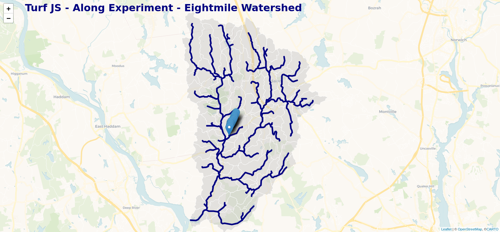
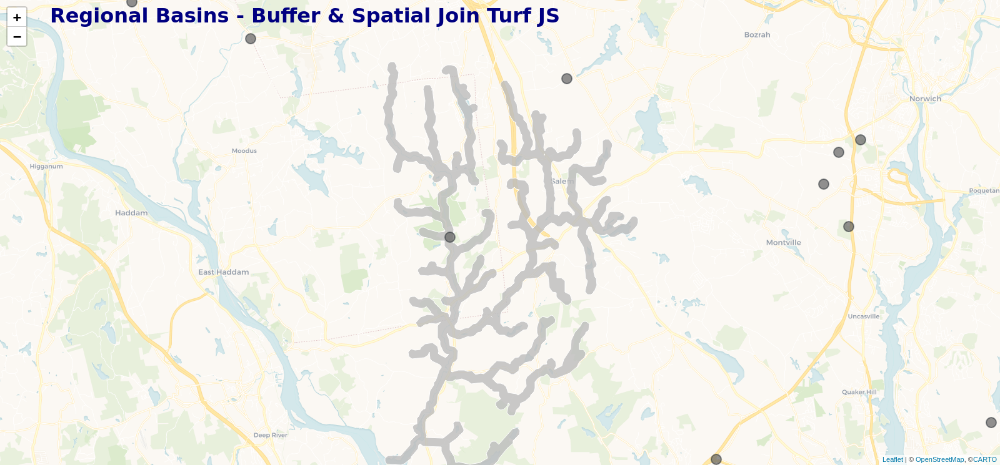

# turfjs-experiments
Experiments with turf js

## Data Sources

Cleaned up high-res (1:24000) stream and catchment layers:
[sheds Hydro Layer](https://conte-ecology.github.io/shedsGisData/)

Regional CT Watersheds:
[CT Regional Basin Polygon](https://ct-deep-gis-open-data-website-ctdeep.hub.arcgis.com/datasets/regional-drainage-basin-polygon/explore?location=41.770067%2C-72.613060%2C8.91)

Wild Brook Trout Stream Survey Resample Sites:
[WBK Sites](https://portal.ct.gov/-/media/DEEP/fishing/fisheries_management/Trout-Research-and-Management/Probabilistic-Sampling-of-Wild-Brook-Trout-Occurrence-in-Stream-Survey-Samples-Final-05082020.pdf)

## Client-Side Turf JS Experiments

https://marybecker.github.io/turfjs-experiments/

The map demonstrates an example of adding points along a line at a specified distance.  In the
example points are add to each line clicked at 100 meter intervals.

Uses [turf.length()](https://turfjs.org/docs/#length), [turf.area()](https://turfjs.org/docs/#area), 
[turf.along()](https://turfjs.org/docs/#along), and [turf.featureCollection](https://turfjs.org/docs/#featureCollection).

## Server-side Turf JS

https://marybecker.github.io/turfjs-experiments/basin.html

The [buffer-stream.js](build-scripts/buffer-stream.js) takes in a MultiLineString and creates a buffer around the 
lines at a specified radius.  The script then dissolves the lines into one feature and simplifies
to make the file smaller.  In this example stream segments are buffered to a 200 meter radius in the 
Eightmile watershed.  Buffer and dissolved stream segments in the Eightmile watershed are shown on the map.

Uses [turf.buffer()](https://turfjs.org/docs/#buffer),[turf.dissolove()](https://turfjs.org/docs/#buffer) 
and [turf.simplify()](https://turfjs.org/docs/#simplify)

The [spatialJoin.js](build-scripts/spatialJoin.js) takes in a Point FeatureCollection and Polygon FeatureCollection
and joins features from the polygon to the points.  The script also provides an example of 
how to load multiple files asynchronously.  In this example wild brook trout sampling sites
are joined a CT regional watershed basin.  In the map, as you hover over a point you can get the 
regional basin that the point is contained in based on the spatial join.  

Uses [turf.tag()](https://turfjs.org/docs/#tag)
